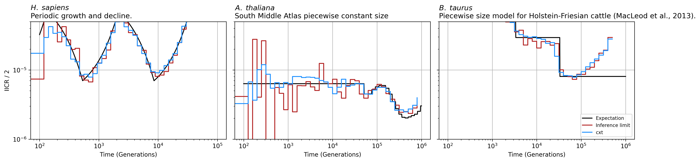
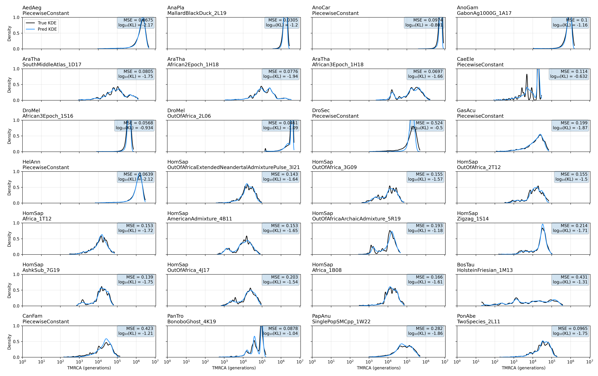
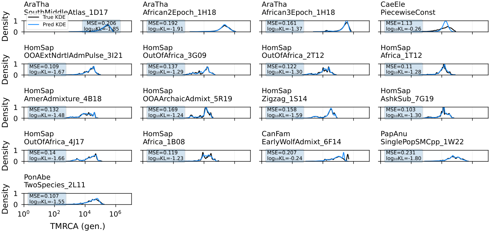
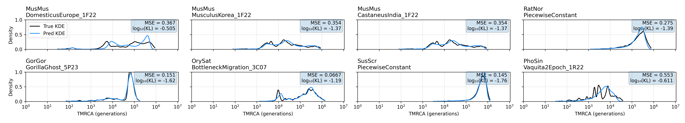

Demography Inference and Coalescence Rates
==========================================

This example benchmarks cxt on a realistic human demographic model
(Zigzag_1S14 from ``stdpopsim``) and converts the resulting TMRCA
distribution into coalescence-rate curves.

   **Figure 5.** Demography inference. Coalescence rates inferred by cxt
   (blue) compared to the inference limit from discretized true TMRCAs (red)
   and the theoretical expectation from the Zigzag_1S14 demographic model
   (black). The cxt curve closely tracks both the true coalescence rates
   and the demographic expectation across five orders of magnitude in time.

Setup and imports
-----------------

.. code-block:: python

   import os
   import numpy as np
   import tskit
   import torch
   import stdpopsim
   import matplotlib.pyplot as plt
   from tqdm import tqdm

   import cxt
   from cxt.utils import coalescence_rates
   from cxt.preprocess import interpolate_tmrcas

   cache_dir = "./cache"
   os.makedirs(cache_dir, exist_ok=True)

   devices = [f"cuda:{i}" for i in range(torch.cuda.device_count())]
   model = cxt.load_model("broad", device="cpu")

Simulating Zigzag_1S14 with stdpopsim
-------------------------------------

We simulate 25 diploid individuals under the human Zigzag_1S14 demography
for 10 Mb of chromosome 1:

.. code-block:: python

   num_pairs = 25
   window_size = 2e3
   seed = int(10e6)
   sequence_length = 10e6

   species = stdpopsim.get_species("HomSap")
   demogr = species.get_demographic_model("Zigzag_1S14")
   contig = species.get_contig("chr1", right=sequence_length)

   population_name = demogr.populations[0].name
   sample = {population_name: num_pairs}
   engine = stdpopsim.get_engine("msprime")

   ts_path = os.path.join(cache_dir, "homsap.ts")
   if not os.path.exists(ts_path):
       ts = engine.simulate(
           contig=contig, samples=sample,
           demographic_model=demogr, seed=seed,
       ).trim()
       ts.dump(ts_path)
   else:
       ts = tskit.load(ts_path)

Computing true TMRCAs
---------------------

We compute discretized true TMRCAs for all pairwise combinations among the
25 individuals:

.. code-block:: python

   true_path = os.path.join(cache_dir, "homsap_true_tmrcas.npy")
   if os.path.exists(true_path):
       true_tmrcas = np.load(true_path)
   else:
       pivot_ids = []
       true_tmrcas = []
       for i in tqdm(range(num_pairs)):
           for j in range(i + 1, num_pairs):
               pivot_ids.append((i, j))
               tmrca_ij = interpolate_tmrcas(
                   ts, window_size=int(window_size),
                   sample_a=i, sample_b=j,
               )
               true_tmrcas.append(tmrca_ij)
       true_tmrcas = np.array(true_tmrcas)
       np.save(true_path, true_tmrcas)

Running cxt
-----------

We analyze the 10 Mb region in 10 non-overlapping 1 Mb blocks:

.. code-block:: python

   blocks = [(int(x), int(x + 1e6))
             for x in np.linspace(0, 9e6, 10)]

   pivot_pairs = [(i, j)
                  for i in range(num_pairs)
                  for j in range(i + 1, num_pairs)]

   tmrca_path = os.path.join(cache_dir, "tmrca_homsap.npz")
   if os.path.exists(tmrca_path):
       data = np.load(tmrca_path)
       tmrca, index_map = data["tmrca"], data["index_map"]
   else:
       tmrca, index_map = cxt.translate(
           ts, model,
           pivot_pairs=pivot_pairs,
           blocks=blocks,
           B_per_device=128, B=128,
           devices=devices,
           build_workers=32,
           mutation_rate=1.29e-8,
       )
       np.savez_compressed(tmrca_path, tmrca=tmrca, index_map=index_map)

Estimating coalescence rates
-----------------------------

We convert windowed TMRCAs into coalescence-rate curves using
:func:`cxt.utils.coalescence_rates` and compare them to the theoretical
trajectory from the demographic model:

.. code-block:: python

   num_time_windows = 40
   max_log_time = np.floor(np.log10(ts.max_time))

   time_windows = np.logspace(2, max_log_time, num_time_windows + 1)
   time_windows[0] = 0.0

   fine_time_grid = np.logspace(2, max_log_time, 1000)
   coalrate_ck, _ = demogr.model.debug().coalescence_rate_trajectory(
       lineages={population_name: 2}, steps=fine_time_grid,
   )

   tmrca_flat = np.exp(tmrca.flatten())
   true_tmrcas_flat = true_tmrcas.flatten()

   yhat_coalrate = coalescence_rates(tmrca_flat, time_windows)
   ytrue_coalrate = coalescence_rates(true_tmrcas_flat, time_windows)

Plotting coalescence rates
--------------------------

.. code-block:: python

   fig, ax = plt.subplots(figsize=(6, 4))

   ax.step(time_windows[:-1], yhat_coalrate, where="post",
           label=r"$\mathbf{cxt}$", color="dodgerblue")
   ax.step(time_windows[:-1], ytrue_coalrate, where="post",
           label="inference limit (discrete)", color="firebrick")
   ax.plot(fine_time_grid, coalrate_ck, "-", color="black",
           label="demographic expectation")

   ax.set_xscale("log")
   ax.set_yscale("log")
   ax.set_xlabel("Time (generations)")
   ax.set_ylabel("Coalescence rate")
   ax.grid(True, which="both", alpha=0.3)
   ax.set_title(r"$\it{H.\;sapiens}$ Zigzag_1S14", loc="left")
   ax.legend()
   fig.tight_layout()
   fig.savefig("figure5_demography.png", dpi=300)

stdpopsim benchmark figures
---------------------------

The paper includes additional benchmarks on the full stdpopsim species
catalog. These panels show KDE distributions of TMRCA predictions compared
to the inference limit across multiple species.

   **Figure 3.** TMRCA KDE distributions across stdpopsim species (flat
   recombination). Each panel compares the cxt distribution to the
   inference-limit distribution for a different species.

   **Figure 3 (continued).** Same comparison for species simulated with
   genetic maps.

   **Figure 4.** Out-of-distribution benchmark. cxt predictions on species
   not seen during training, demonstrating generalization across diverse
   demographic histories and genome architectures.
