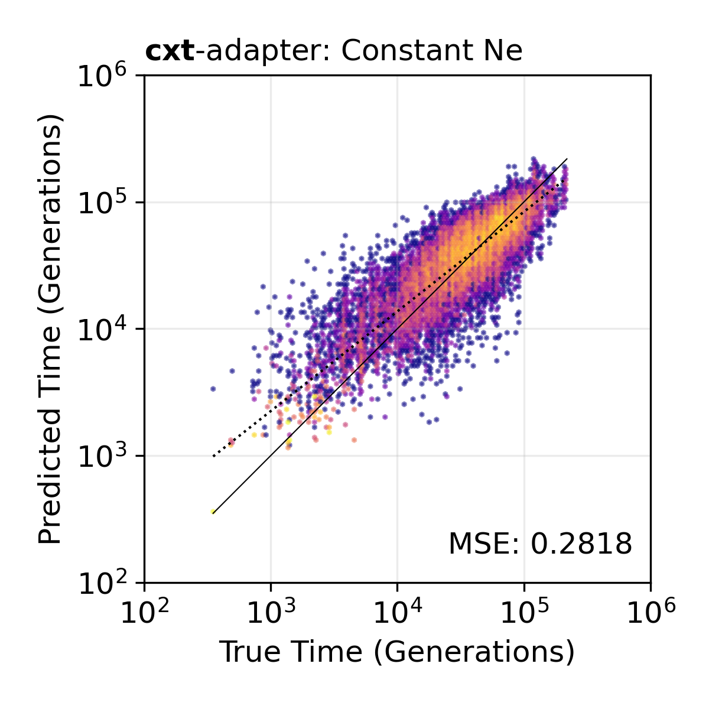
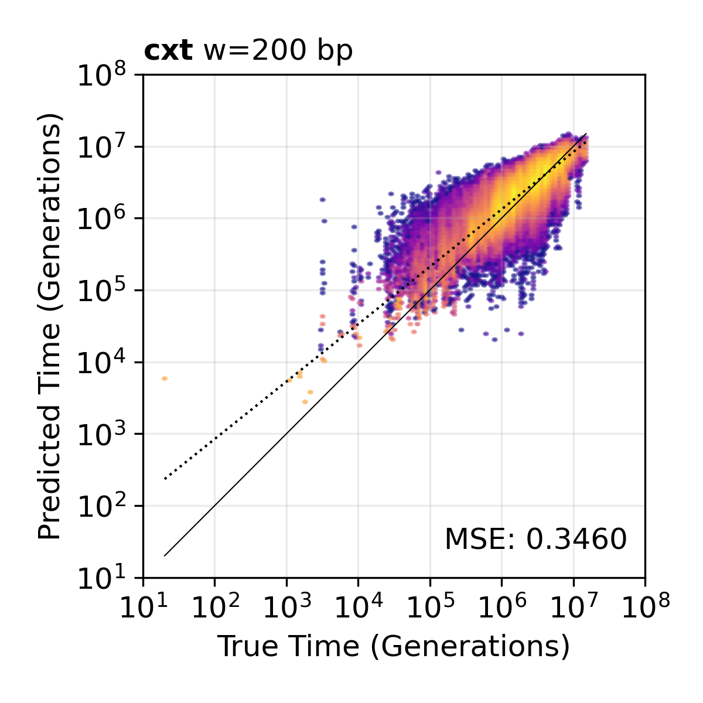
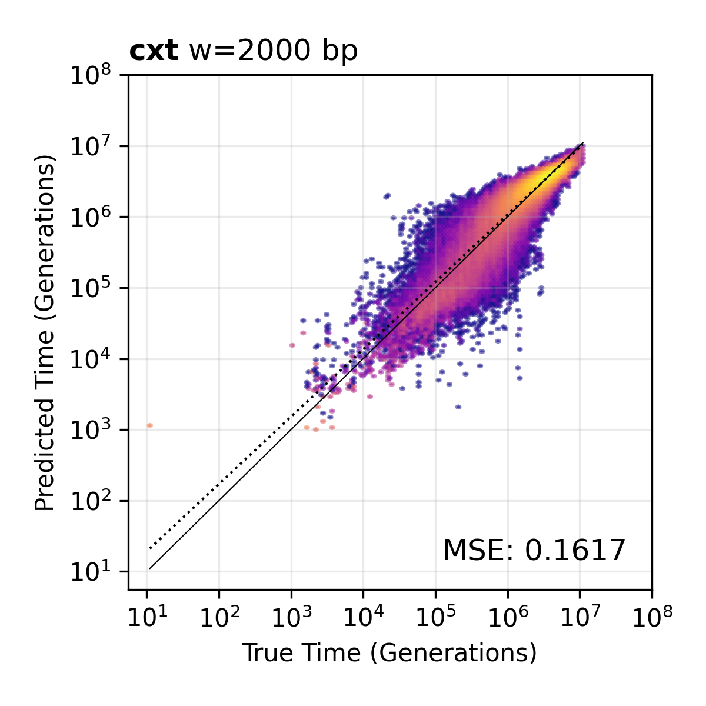
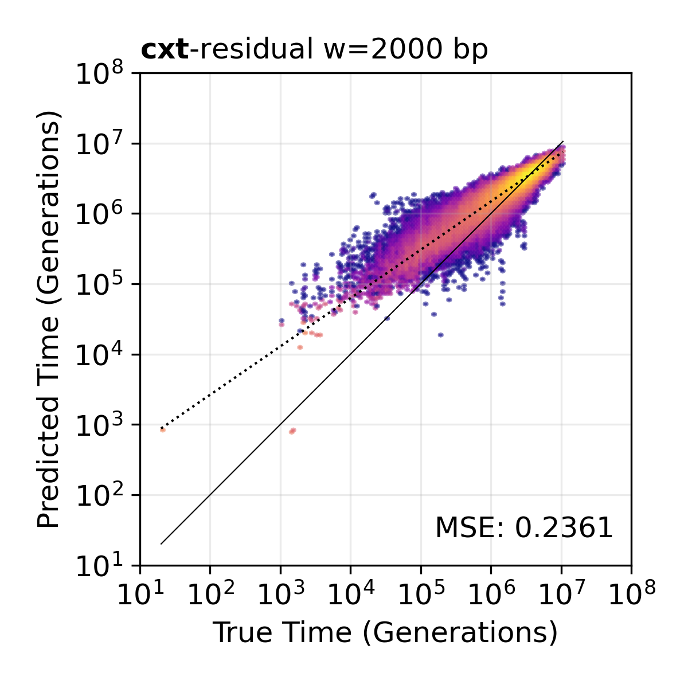

Examples
========

This page demonstrates the core cxt inference workflow: loading models,
decoding pairwise TMRCA trajectories from tree sequences, and using
adapter modules for sample-size transfer.

Loading pretrained models
-------------------------

cxt ships with seven pretrained model variants. All are loaded via
:func:`cxt.load_model`, which downloads and caches checkpoints automatically.

.. code-block:: python

   import cxt

   model_types = [
       "broad",            # main model (10 layers, w2000)
       "narrow",           # smaller model (6 layers, w2000)
       "broad_w200",       # 200 bp windows for large-Ne species
       "residual",         # log-residual targets
       "w200_wmissing",    # 200 bp windows with missingness
       "broad+adapter",    # 10-sample adapter on broad
       "w200_wmissing_adapter",  # 10-sample adapter with missingness
   ]

   for mt in model_types:
       model = cxt.load_model(mt, device="cpu")
       n_params = sum(p.numel() for p in model.parameters())
       print(f"{mt:30s}  {n_params:>12,} parameters")

Checkpoints are cached in ``~/.cache/cxt/checkpoints/`` and reused on
subsequent calls.

Simulating a tree sequence
--------------------------

For demonstration, we simulate a 1 Mb recombining tree sequence with
``msprime``:

.. code-block:: python

   import msprime

   ts = msprime.sim_ancestry(
       25,
       recombination_rate=1e-8,
       sequence_length=1e6,
       population_size=2e4,
       random_seed=42,
   )
   ts = msprime.mutate(ts, rate=1.29e-8, random_seed=42)

:func:`cxt.translate` also accepts VCF files and ``(genotype_matrix,
positions)`` tuples.

Decoding pairwise TMRCA
------------------------

The central inference step uses :func:`cxt.translate`. Here we decode the
TMRCA trajectory for selected pivot pairs across a 1 Mb genomic block:

.. code-block:: python

   model = cxt.load_model("broad", device="cuda")

   blocks = [(0, 1_000_000)]
   pivot_pairs = [(0, 1), (2, 3), (4, 5)]
   devices = ["cuda:0"]

   tmrca, index_map = cxt.translate(
       ts, model,
       pivot_pairs=pivot_pairs,
       blocks=blocks,
       devices=devices,
       B=128,
       n_reps=15,
       build_workers=8,
       mutation_rate=1.29e-8,
   )

**Outputs:**

- ``tmrca``: log-TMRCA predictions, shape ``(n_items, n_reps, n_windows)``
  when ``n_reps > 1``, or ``(n_items, n_windows)`` otherwise.
- ``index_map``: array of shape ``(n_items, 2)`` mapping each row to
  ``[block_idx, pivot_idx]``.

Key parameters:

- ``B``: batch size per device during generation.
- ``n_reps``: number of stochastic replicates (default 15). More replicates
  give smoother estimates; the mean across replicates is typically used.
- ``build_workers``: parallel workers for SFS source construction.
- ``mutation_rate``: if provided, applies a per-block stochastic diversity
  bias correction.

Multi-GPU inference
-------------------

Passing multiple devices automatically shards the workload:

.. code-block:: python

   tmrca, index_map = cxt.translate(
       ts, model,
       pivot_pairs=pivot_pairs,
       blocks=blocks,
       devices=["cuda:0", "cuda:1", "cuda:2"],
       B_per_device=256,
       build_workers=32,
       mutation_rate=1.29e-8,
   )

Sample-size transfer with adapters
-----------------------------------

Adapter models enable inference on sample sizes different from those seen
during training. The ``broad+adapter`` model maps 10-sample input to the
50-sample feature space expected by the frozen backbone.

.. code-block:: python

   adapter_model = cxt.load_model("broad+adapter", device="cuda")

   ts_n10 = ts.simplify(samples=range(10))

   tmrca, index_map = cxt.translate(
       ts_n10,
       adapter_model.backbone,
       pivot_pairs=[(0, 1), (2, 3)],
       blocks=[(0, 1_000_000)],
       devices=["cuda:0"],
       B=128,
       build_workers=8,
       mutation_rate=1.29e-8,
       adapter=adapter_model.adapter,
   )

   **Sample-size adapter.** TMRCA inference using the broad+adapter model
   on 10 haploid samples. The adapter learns to project 10-sample SFS
   features into the 50-sample space of the frozen backbone.

Window resolution variants
---------------------------

The ``broad_w200`` and ``w200_wmissing`` variants use 200 bp windows instead
of the default 2,000 bp, providing finer-scale resolution at the cost of a
smaller effective genomic range per block. These models are especially useful
for species with large effective population sizes where SFS density per
window is higher.

.. code-block:: python

   model_w200 = cxt.load_model("broad_w200", device="cuda")

   tmrca, index_map = cxt.translate(
       ts, model_w200,
       pivot_pairs=[(0, 1)],
       blocks=[(0, 100_000)],
       devices=["cuda:0"],
   )

   **200 bp window resolution.** TMRCA scatter plot at 200 bp window
   resolution, providing finer genomic detail.

   **2,000 bp window resolution.** The default window size used by the
   broad and narrow models.

   **Residual model.** TMRCA inference using the residual variant, which
   predicts log-deviations from the population mean.

Missingness-aware inference
---------------------------

For empirical data with missing sites (e.g. inaccessible regions in the
Ag1000G), the ``w200_wmissing`` model encodes per-window missingness
directly into the source tensor:

.. code-block:: python

   import numpy as np

   model_wmissing = cxt.load_model("w200_wmissing", device="cuda")

   unaccessible_bitmask = np.load("accessibility.npz")["access_2L"]
   unaccessible_bitmask = ~unaccessible_bitmask

   tmrca, index_map = cxt.translate(
       ts, model_wmissing,
       pivot_pairs=[(0, 1)],
       blocks=[(0, 100_000)],
       devices=["cuda:0"],
       missingness_bitmask=unaccessible_bitmask,
       mutation_rate=3.5e-9,
   )

VCF input
---------

cxt can infer TMRCAs directly from VCF files:

.. code-block:: python

   tmrca, index_map = cxt.translate(
       "path/to/genotypes.vcf",
       model,
       blocks=[(0, 1_000_000)],
       pivot_pairs=[(0, 1)],
       devices=["cuda:0"],
   )

The VCF is parsed into a genotype matrix and positions internally using
:func:`cxt.translate.vcf_parser`.

Genotype matrix input
---------------------

For pre-processed data, pass a ``(genotype_matrix, positions)`` tuple:

.. code-block:: python

   import numpy as np

   gm = np.load("genotypes.npy")     # (n_haplotypes, n_sites), int
   pos = np.load("positions.npy")    # (n_sites,), float, in bp

   tmrca, index_map = cxt.translate(
       (gm, pos), model,
       blocks=[(0, 1_000_000)],
       pivot_pairs=[(0, 1), (2, 3)],
       devices=["cuda:0"],
   )
