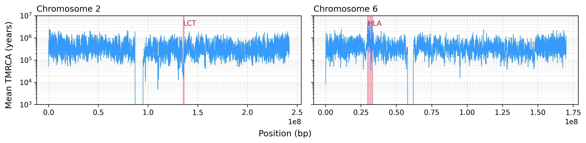
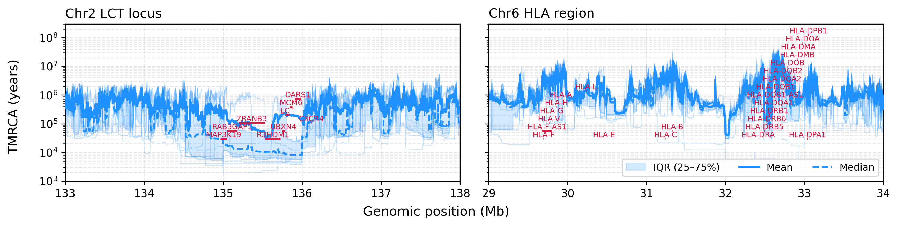

Human 1000 Genomes: LCT and HLA
=================================

This example applies cxt to GBR samples from the 1000 Genomes Project to
decode chromosome-scale TMRCA landscapes and zoom into the LCT locus
(chromosome 2) and HLA region (chromosome 6).

   **Figure 6a.** Chromosome-wide TMRCA for GBR samples. Left: chromosome 2
   with the LCT locus highlighted in red. Right: chromosome 6 with the HLA
   region highlighted. The LCT region shows a pronounced TMRCA trough
   consistent with recent positive selection, while the HLA region exhibits
   elevated TMRCA due to long-term balancing selection.

   **Figure 6b.** Zoomed view of the LCT and HLA regions with individual
   replicate traces (light blue), IQR band (shaded), mean (solid) and
   median (dashed) trajectories, and gene annotations (crimson bars).

Pipeline overview
-----------------

1. Load tsinfer-based tree sequences for chr2p/chr2q and chr6p/chr6q.
2. Run :func:`cxt.translate` in 1 Mb blocks on 25 pivot pairs.
3. Apply a post-hoc stochastic diversity-based bias correction.
4. Stitch p and q arms into whole-chromosome TMRCA tracks.
5. Plot chromosome-wide curves and zoom into LCT and HLA with gene
   annotations.

.. note::

   Unlike the mosquito analysis, we do **not** use a missingness-aware model
   variant here. Instead, a *post-hoc stochastic diversity bias correction*
   accounts for the moderate missingness in these human regions.

Model and devices
-----------------

.. code-block:: python

   import os
   import numpy as np
   import torch
   import tszip
   import cxt

   devices = [f"cuda:{i}" for i in range(torch.cuda.device_count())]
   model = cxt.load_model("broad", device="cpu")

   cache_dir = "./cache"
   os.makedirs(cache_dir, exist_ok=True)

Loading GBR tree sequences
--------------------------

We load precomputed tsinfer-based trees for four chromosome arms, simplify
to 50 haploid samples, and cache locally:

.. code-block:: python

   TSZ_DIR = "/path/to/hg1kg/tsinfer-trees"

   arms = {}
   for arm_name in ["chr2p", "chr2q", "chr6p", "chr6q"]:
       tsz_cache = os.path.join(cache_dir, f"gbr_{arm_name}.tsz")
       if os.path.exists(tsz_cache):
           arms[arm_name] = tszip.load(tsz_cache)
       else:
           ts = tszip.load(os.path.join(TSZ_DIR, f"{arm_name}.tsz"))
           ts = ts.simplify(samples=np.arange(50))
           tszip.compress(ts, tsz_cache)
           arms[arm_name] = ts

       print(f"{arm_name}: {arms[arm_name].num_samples} samples, "
             f"{arms[arm_name].sequence_length:.0f} bp")

Inference on 1 Mb blocks
-------------------------

We tile each arm into 1 Mb blocks and use 25 consecutive pivot pairs:

.. code-block:: python

   pivot_pairs = [(i, i + 1) for i in range(0, 50, 2)]

   def infer_arm(ts, name):
       cache_path = os.path.join(cache_dir, f"gbr_{name}.npz")
       if os.path.exists(cache_path):
           data = np.load(cache_path)
           return data["tmrca"], data["index_map"]

       num_blocks = int(ts.sequence_length // 1e6)
       blocks = [(int(i * 1e6), int((i + 1) * 1e6)) for i in range(num_blocks)]

       tmrca, index_map = cxt.translate(
           ts, model,
           pivot_pairs=pivot_pairs,
           blocks=blocks,
           B_per_device=128, B=128,
           devices=devices,
           build_workers=32,
       )
       np.savez_compressed(cache_path, tmrca=tmrca, index_map=index_map)
       return tmrca, index_map

   results = {}
   for arm_name, ts in arms.items():
       results[arm_name] = infer_arm(ts, arm_name)

Post-hoc diversity correction
------------------------------

We estimate per-window missingness from bcftools masks and apply a
stochastic diversity-based correction per block:

.. code-block:: python

   from cxt.correction import stochastic_diversity_bias_correction

   mutation_rate = 1.29e-8

   def correct_arm(tmrca, index_map, ts, availability, name):
       cache_path = os.path.join(cache_dir, f"genome_{name}.npz")
       if os.path.exists(cache_path):
           return np.load(cache_path)["genome"]

       num_blocks = int(ts.sequence_length // 1e6)
       blocks = [(int(i * 1e6), int((i + 1) * 1e6)) for i in range(num_blocks)]

       corrected_blocks = []
       for b_idx in range(num_blocks):
           mask = index_map[:, 0] == b_idx
           block = blocks[b_idx]
           avail = availability[b_idx] / 100 if availability is not None else 1.0

           try:
               ts_block = ts.keep_intervals([block], simplify=True)
               rng = np.random.default_rng(20_000_001 + b_idx)
               out = stochastic_diversity_bias_correction(
                   tree_sequence=ts_block,
                   mutation_rate=mutation_rate / max(avail, 0.01),
                   predictions=tmrca[:, mask],
                   pivot_pairs=np.array(pivot_pairs),
                   rng=rng,
               )
               corrected_blocks.append(out.mean(0))
           except Exception:
               corrected_blocks.append(np.zeros([25, 500]))

       genome = np.stack(corrected_blocks).transpose(1, 0, 2).reshape(25, -1)
       np.savez_compressed(cache_path, genome=genome)
       return genome

Stitching chromosome-wide tracks
---------------------------------

.. code-block:: python

   genome_chr2 = (
       correct_arm(*results["chr2p"], arms["chr2p"], chr2_available, "chr2p")
       + correct_arm(*results["chr2q"], arms["chr2q"], chr2_available, "chr2q")
   )
   genome_chr6 = (
       correct_arm(*results["chr6p"], arms["chr6p"], chr6_available, "chr6p")
       + correct_arm(*results["chr6q"], arms["chr6q"], chr6_available, "chr6q")
   )

Chromosome-wide plot
--------------------

.. code-block:: python

   import matplotlib.pyplot as plt

   generation_time = 28
   BIN_BP = 2000

   lct_start, lct_end = 135_300_000, 136_400_000
   hla_start, hla_end = 29_600_000, 33_300_000

   fig, axes = plt.subplots(1, 2, figsize=(12, 3), sharex=False, sharey=True)

   for ax, genome, label in [
       (axes[0], genome_chr2, "Chromosome 2"),
       (axes[1], genome_chr6, "Chromosome 6"),
   ]:
       x = np.arange(genome.shape[1]) * BIN_BP
       y = np.exp(genome.mean(0)) * generation_time
       ax.plot(x, y, linewidth=0.8, color="dodgerblue", alpha=0.9)
       ax.set_yscale("log")
       ax.set_title(label, loc="left", fontsize=12)
       ax.grid(alpha=0.3, which="both", linestyle="--")

   axes[0].axvspan(lct_start, lct_end, color="crimson", alpha=0.3, label="LCT")
   axes[1].axvspan(hla_start, hla_end, color="crimson", alpha=0.3, label="HLA")
   axes[0].text(lct_start, 3e6, "LCT", color="crimson", fontsize=10, va="bottom")
   axes[1].text(hla_start, 3e6, "HLA", color="crimson", fontsize=10, va="bottom")

   fig.text(0.5, 0.03, "Position (bp)", ha="center", fontsize=12)
   fig.text(0.04, 0.5, "Mean TMRCA (years)", va="center",
            rotation="vertical", fontsize=12)

   plt.tight_layout(rect=[0.05, 0.05, 1, 0.95])
   plt.ylim(1e3, 1e7)
   fig.savefig("figure6_human_1kg.png", dpi=300, bbox_inches="tight")

Zoomed panels with gene annotations
-------------------------------------

The zoomed LCT and HLA panels overlay individual replicate traces, IQR
bands, and gene annotations. Key genes at each locus:

- **LCT region** (chr2, 133--138 Mb): *LCT*, *MCM6*, *DARS1*, *R3HDM1*,
  *ZRANB3*, *UBXN4*, *RAB3GAP1*, *CXCR4*
- **HLA region** (chr6, 29--34 Mb): *HLA-A*, *HLA-B*, *HLA-C*, *HLA-DRB1*,
  *HLA-DQA1*, *HLA-DQB1*, *HLA-DPA1*, *HLA-DPB1*

The plotting code is available in ``figures/main/fig6_human_1kg.py``.

The LCT region shows a sharp reduction in TMRCA consistent with the
well-documented signature of recent positive selection on lactase
persistence in European populations. The HLA region displays elevated and
highly variable TMRCA, reflecting ancient balancing selection maintaining
MHC diversity.
