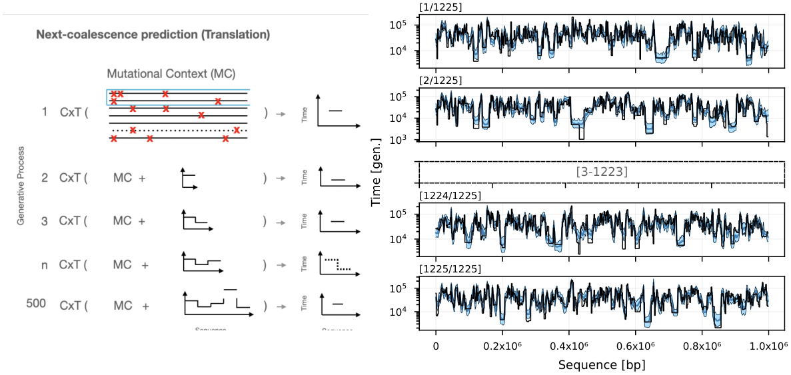

.. cxt documentation master file

cxt: Coalescence x Translation
=============================================

``cxt`` is a transformer-based method for inferring pairwise coalescent times
(TMRCA) from genotype data using a language-modelling approach. For each pair
of haplotypes it computes a multi-scale site-frequency spectrum (SFS) in
sliding windows, feeds it through a token-free transformer decoder, and
outputs a discretized log-TMRCA profile across the genome.

   **Figure 1.** cxt introduces the notion of next-coalescence prediction
   (Left). cxt is a language model that conditions on a chosen "pivot"
   haplotype pair and predicts the pair's TMRCA for each window. cxt
   ingests mutational tensors constructed using the pivot pair and SFS values
   computed in windows across a focal region. The model works
   autoregressively: after each window is predicted, that estimate is
   appended to the context and supplied to the next step, yielding a
   step-wise reconstruction of the entire pairwise coalescent history.
   In the right panel all :math:`\binom{50}{2}` pairwise coalescence curves
   for a sample of 50 haplotypes were inferred simultaneously in under five
   minutes on a single NVIDIA A100 GPU.

Key features
------------

- **No tree-sequence inference required** -- works directly on genotype
  matrices, VCF files, or ``tskit`` tree sequences.
- **Stochastic sampling** -- multiple replicate predictions yield uncertainty
  estimates for each genomic window.
- **Bias correction** -- optional Bayesian diversity-based correction accounts
  for mutation-rate scaling and missingness.
- **Multiple model variants** -- narrow, broad, broad_w200, w200_wmissing,
  and adapter-based models for different sample sizes and data
  characteristics.
- **Multi-GPU inference** -- pairs are automatically sharded across GPUs for
  high throughput.

Model variants
--------------

.. list-table::
   :header-rows: 1
   :widths: 20 20 10 50

   * - Name
     - Preset
     - Layers
     - Description
   * - ``narrow``
     - ``PRESETS["narrow"]``
     - 6
     - Smaller model, faster inference
   * - ``broad``
     - ``PRESETS["broad"]``
     - 10
     - Main model, best overall accuracy
   * - ``residual``
     - ``PRESETS["residual"]``
     - 10
     - Predicts log-residuals from the population mean
   * - ``broad_w200``
     - ``PRESETS["broad_w200"]``
     - 10
     - 200 bp windows for fine-scale resolution in large-\ :math:`N_e` species
   * - ``w200_wmissing``
     - ``PRESETS["w200_wmissing"]``
     - 10
     - 200 bp windows with explicit missingness support
   * - ``broad+adapter``
     - adapter on ``broad``
     - 10
     - 10-sample adapter on the broad backbone
   * - ``w200_wmissing_adapter``
     - adapter on ``w200_wmissing``
     - 10
     - 10-sample adapter with missingness support

.. figure:: decoding.gif
   :align: center
   :width: 80%
   :alt: Decoding process in cxt

   Window-wise autoregressive decoding of coalescence times. Multiple
   stochastic replicates are averaged to obtain a robust TMRCA estimate.

.. toctree::
   :maxdepth: 2
   :caption: Getting Started

   installation
   quick_start
   verification

.. toctree::
   :maxdepth: 2
   :caption: Usage Guide

   examples
   finetune_missingness
   demography
   human
   mosquito

.. toctree::
   :maxdepth: 2
   :caption: Reproducing the Paper

   reproduce
   simulation
   preprocessing
   training

.. toctree::
   :maxdepth: 2
   :caption: Reference

   cxt

Indices and tables
==================

* :ref:`genindex`
* :ref:`search`
