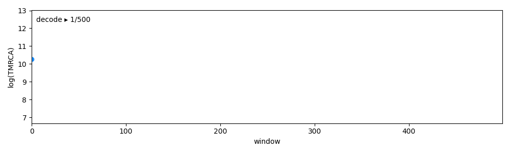

.. cxt documentation master file, created by
   sphinx-quickstart on Sat Dec 21 11:21:20 2024.
   You can adapt this file completely to your liking, but it should at least
   contain the root `toctree` directive.

cxt: Coalescence x Translation 
=============================================

``cxt`` stands for coalescence x translation and thereby proposing a sequence or language modelling approach to population genetic inference.

   Window-wise decoding of coalescence times using replicates and taking the average with the cxt model.

.. toctree::
   :maxdepth: 2
   :caption: Contents:

   installation
   quick_start
   examples
   demography
   human
   mosquito
   simulation
   preprocessing
   training

Indices and tables
==================

* :ref:`genindex`
* :ref:`search`

