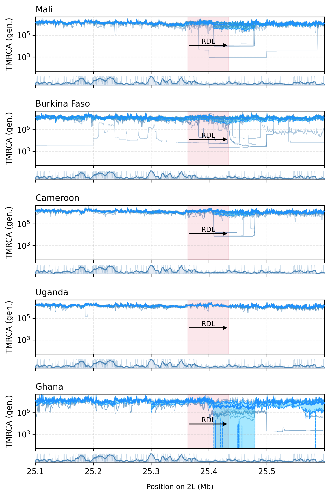
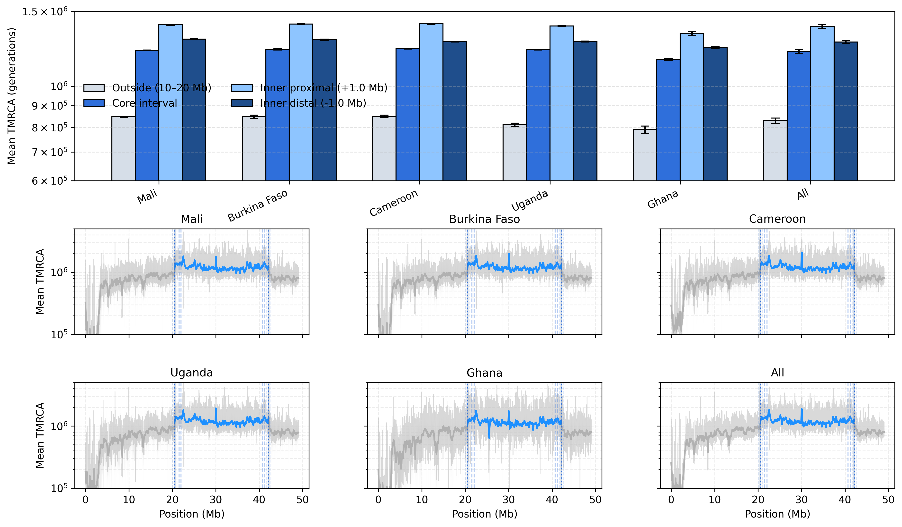
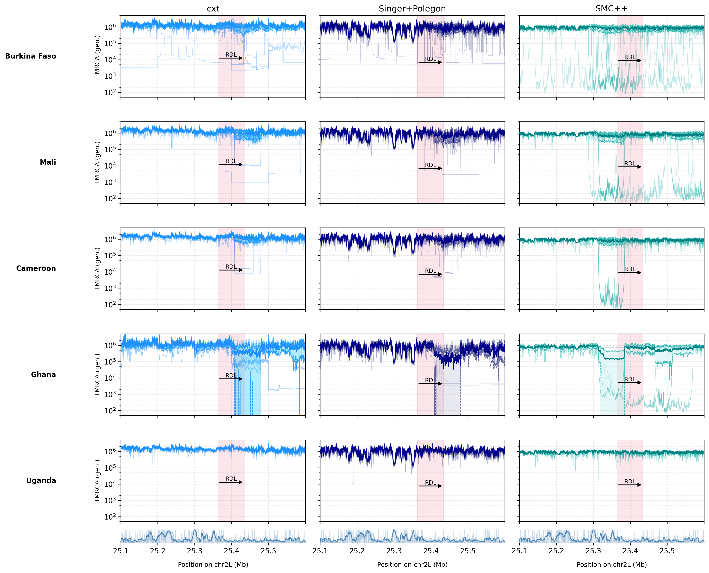
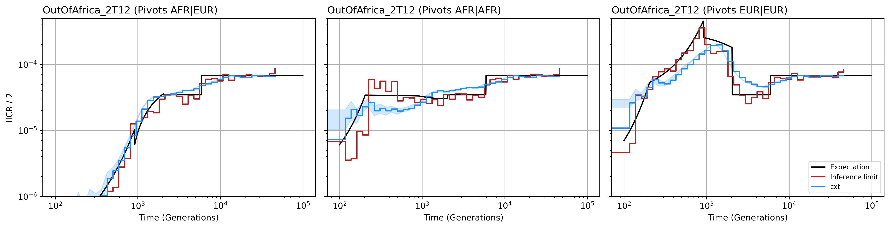

Mosquito: 2L Inversion and RDL Sweep
=====================================

This example applies cxt to *Anopheles gambiae* (Ag1000G) data on chromosome
2L to visualize coalescent-time patterns across the 2La inversion and the
RDL insecticide-resistance locus.

   **Figure 7.** RDL sweep region (25.1--25.6 Mb on chr2L) across five
   African *A. gambiae* populations. Each panel shows individual replicate
   traces (light blue), mean :math:`\pm` SD band, and the RDL gene
   highlighted in red. The bottom track shows the Ag1000G accessibility
   (missingness) pattern. Note the sharp TMRCA reduction at the RDL locus,
   consistent with a selective sweep on insecticide resistance.

   **Figure 8.** Coalescent-time structure across the In(2L)a inversion.
   **Top:** Bar chart comparing mean TMRCA in four genomic regions -- outside
   the inversion (10--20 Mb), the core interval, inner proximal (+1.0 Mb),
   and inner distal (-1.0 Mb) -- for each population and across all
   populations combined. **Bottom:** Genome-wide 2L TMRCA profiles with the
   inversion interval highlighted in blue.

Pipeline overview
-----------------

1. Load and subset Ag1000G 2L tree sequences per population and inversion
   genotype (2La heterozygotes).
2. Load the accessibility bitmask and derive missingness tracks.
3. Run :func:`cxt.translate` with the missingness-aware model variant
   (``w200_wmissing``).
4. For Ghana (fewer available individuals), use the
   ``w200_wmissing_adapter`` model with 10-sample input.
5. Aggregate TMRCAs per genome and per population.
6. Plot the RDL zoom panel and the genome-wide inversion panel.

Model and data setup
--------------------

.. code-block:: python

   import os
   import json
   import numpy as np
   import torch
   import tskit
   import cxt

   cache_dir = "./cache"
   os.makedirs(cache_dir, exist_ok=True)

   data_path = "/path/to/Ag1000G/gamb.2L.gff.dated.ne.trees"
   accessible_path = "/path/to/Ag1000G/agp3.is_accessible.txt.npz"

   devices = [f"cuda:{i}" for i in range(torch.cuda.device_count())]

   model = cxt.load_model("w200_wmissing", device="cpu")
   adapter_model = cxt.load_model("w200_wmissing_adapter", device="cpu")

Loading and subsetting populations
-----------------------------------

We subset the full 2L tree sequence to 2La heterozygous individuals from
each population:

.. code-block:: python

   POPULATIONS = {
       "BurkinaFaso": "Burkina Faso",
       "Mali": "Mali",
       "Cameroon": "Cameroon",
       "Ghana": "Ghana",
       "Uganda": "Uganda",
   }

   def load_population_ts(full_ts, country_name, n_individuals=25):
       ts_path = os.path.join(
           cache_dir, f"ts_{country_name.lower().replace(' ', '_')}.trees"
       )
       if os.path.exists(ts_path):
           return tskit.load(ts_path)

       ids = []
       for ind in full_ts.individuals():
           meta = json.loads(ind.metadata.decode("ascii"))
           if meta["country"] == country_name and int(meta["2La"]) == 1:
               ids.append(ind.nodes)

       ts_pop = full_ts.simplify(samples=np.concatenate(ids[:n_individuals]))
       ts_pop.dump(ts_path)
       return ts_pop

Accessibility mask
------------------

.. code-block:: python

   bitmask = np.load(accessible_path)["access_2L"]
   unaccessible_bitmask = ~bitmask

Running cxt with missingness
-----------------------------

Genome-wide 2L is tiled into 490 blocks of 100 kb each:

.. code-block:: python

   N_BLOCKS = 490
   BLOCK_SIZE = 0.1e6
   MUTATION_RATE = 3.5e-9

   blocks = [(int(i * BLOCK_SIZE), int((i + 1) * BLOCK_SIZE))
             for i in range(N_BLOCKS)]

   full_ts = tskit.load(data_path)

   # Standard populations (25 individuals each)
   for pop_key, country_name in POPULATIONS.items():
       if pop_key == "Ghana":
           continue

       ts_pop = load_population_ts(full_ts, country_name)
       pivot_pairs = [tuple(ind.nodes) for ind in ts_pop.individuals()]

       tmrca, index_map = cxt.translate(
           ts_pop, model,
           pivot_pairs=pivot_pairs,
           blocks=blocks,
           missingness_bitmask=unaccessible_bitmask,
           devices=devices,
           B_per_device=512, B=512,
           build_workers=36,
           mutation_rate=MUTATION_RATE,
       )
       np.savez_compressed(
           os.path.join(cache_dir, f"tmrca_{pop_key.lower()}_wmissing_2L.npz"),
           tmrca=tmrca, index_map=index_map,
       )

Ghana with adapter
------------------

Ghana uses the adapter model variant, downsampled to 10 haploid samples:

.. code-block:: python

   ts_ghana = load_population_ts(full_ts, "Ghana")
   ts_ghana = ts_ghana.simplify(samples=np.arange(0, 10))
   pivot_pairs_ghana = [tuple(ind.nodes) for ind in ts_ghana.individuals()]

   tmrca_ghana, index_map_ghana = cxt.translate(
       ts_ghana,
       adapter_model.backbone,
       pivot_pairs=pivot_pairs_ghana,
       blocks=blocks,
       missingness_bitmask=unaccessible_bitmask,
       devices=devices,
       B_per_device=512, B=512,
       build_workers=36,
       mutation_rate=MUTATION_RATE,
       adapter=adapter_model.adapter,
   )

Assembling genome-wide TMRCA
-----------------------------

.. code-block:: python

   def make_genome(tmrca, index_map, pivot_pairs):
       genomes = []
       for i in range(len(pivot_pairs)):
           mask = index_map[:, 1] == i
           if tmrca.ndim == 3:
               pair_data = tmrca[:, mask].mean(axis=0)
           else:
               pair_data = tmrca[mask]
           genomes.append(pair_data.flatten())
       return np.exp(np.array(genomes))

RDL region
----------

The RDL insecticide-resistance gene spans 25.36--25.43 Mb on chr2L. The
zoom window covers 25.1--25.6 Mb, showing the sharp TMRCA reduction
characteristic of a selective sweep at the *Rdl* locus (resistance to
dieldrin).

The RDL signal is visible across all five populations, with Mali and
Burkina Faso showing the strongest sweep signatures, consistent with
intense insecticide pressure in West Africa.

2La inversion structure
-----------------------

The In(2L)a inversion (approximately 20.5--42.2 Mb) creates distinct
coalescent-time patterns:

- **Core interval**: elevated TMRCA within the inversion, reflecting
  reduced gene flow between karyotypes.
- **Breakpoint regions**: sharp TMRCA transitions at the proximal and
  distal inversion boundaries.
- **Outside**: baseline TMRCA levels in the flanking regions.

   **Supplementary Figure S9.** Population-level comparison of TMRCA
   patterns across the full 2L chromosome arm.

Cross-coalescence patterns
---------------------------

   **Supplementary Figure S10.** Cross-coalescence patterns between
   populations, revealing shared and divergent demographic histories.

Reproducing the figures
-----------------------

The complete figure scripts with all plotting details are available at:

- ``figures/main/fig7_mosquito_rdl.py`` -- RDL zoom panel (Figure 7)
- ``figures/main/fig8_inversion_coalescence.py`` -- Inversion bar chart
  and genome-wide panels (Figure 8)

Run them via:

.. code-block:: bash

   python figures/main/fig7_mosquito_rdl.py --output-dir figures/output/main
   python figures/main/fig8_inversion_coalescence.py --output-dir figures/output/main
