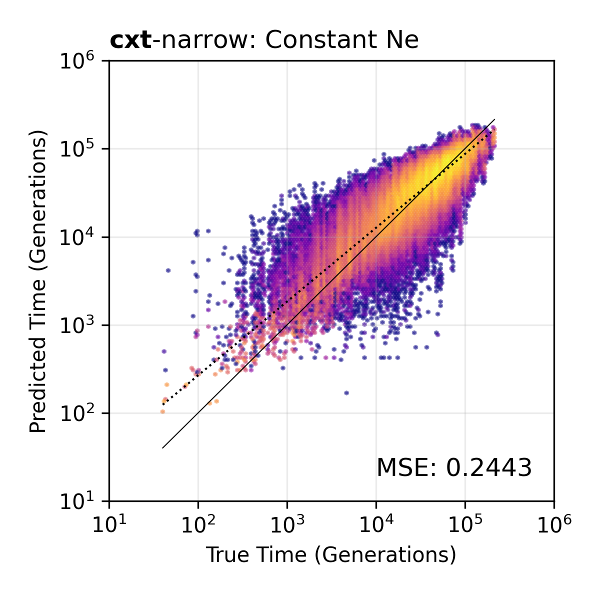
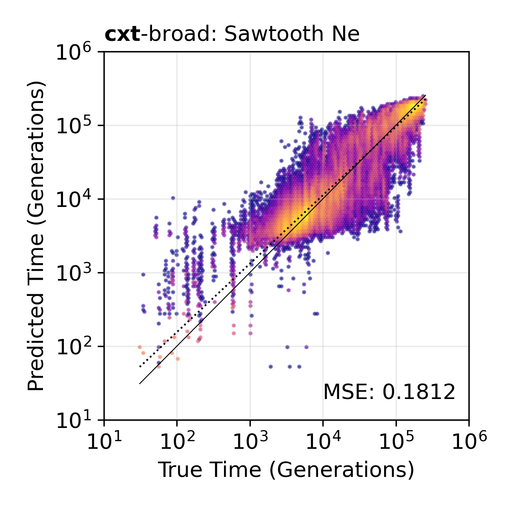

Quick Start
===========

This page demonstrates the core cxt workflow in under 20 lines of code:
simulate a tree sequence, run inference, and compare inferred versus true
coalescent times.

Minimal example
---------------

.. code-block:: python

   import cxt
   import msprime
   import numpy as np

   # 1. Simulate a 1 Mb tree sequence
   ts = msprime.sim_ancestry(
       25, population_size=2e4, sequence_length=1e6,
       recombination_rate=1.28e-8, random_seed=42,
   )
   ts = msprime.mutate(ts, rate=1.29e-8, random_seed=42)

   # 2. Load a pretrained model
   model = cxt.load_model("broad", device="cuda")

   # 3. Infer TMRCA for selected haplotype pairs
   tmrca, index_map = cxt.translate(
       ts, model,
       blocks=[(0, 1_000_000)],
       pivot_pairs=[(0, 1), (2, 3), (4, 5)],
       devices=["cuda:0"],
       n_reps=15,
       mutation_rate=1.29e-8,
   )

   # tmrca shape: (n_items, n_reps, n_windows) -- log-TMRCA values
   print(f"Inferred TMRCA shape: {tmrca.shape}")

Benchmark: constant :math:`N_e`
-------------------------------

The following example reproduces the narrow-model constant-\ :math:`N_e`
benchmark scatter plot from the paper. It compares inferred TMRCAs against
the true values from the simulated tree sequence.

.. code-block:: python

   import os
   import numpy as np
   from concurrent.futures import ProcessPoolExecutor

   import cxt
   from cxt.simulate import simulate_parameterized_tree_sequence
   from cxt.preprocess import interpolate_tmrca_per_window_spanavg

   # Simulate
   ts = simulate_parameterized_tree_sequence(seed=103370001)

   # Load model
   model = cxt.load_model("narrow", device="cuda")

   # All pairwise combinations among 50 haploid samples
   pivot_pairs = [(i, j) for i in range(50) for j in range(i + 1, 50)]

   # Infer
   yhat_tmrca, index_map = cxt.translate(
       ts, model,
       pivot_pairs=pivot_pairs,
       blocks=[(0, 1_000_000)],
       devices=["cuda:0", "cuda:1", "cuda:2"],
       B=256,
       build_workers=8,
       mutation_rate=1.29e-8,
   )

   # Compute true TMRCAs
   def _true(args):
       ts, a, b = args
       return interpolate_tmrca_per_window_spanavg(
           ts.simplify(samples=[a, b]), window_size=2000, sequence_length=1e6,
       )

   with ProcessPoolExecutor(max_workers=24) as ex:
       ytrues = list(ex.map(_true, [(ts, a, b) for a, b in pivot_pairs]))

   yhats = [np.exp(yhat_tmrca).mean(0)[i] for i in range(len(pivot_pairs))]

   # Scatter plot
   from cxt.utils import plot_inference_scatter

   plot_inference_scatter(
       np.array(yhats).flatten(),
       np.array(ytrues).flatten(),
       "cxt_constant.png",
       tool=r"$\mathbf{cxt}$-narrow: Constant $N_e$",
   )

   **Constant** :math:`N_e` **benchmark.** Inferred (y-axis) versus true (x-axis)
   pairwise TMRCA values using the cxt-narrow model. Each point is one
   2 kb genomic window for one haplotype pair.

   **Sawtooth demography benchmark.** The same comparison under a more complex
   sawtooth demographic model using the cxt-broad variant.

Input formats
-------------

cxt accepts three input types via the unified :func:`cxt.translate` interface:

**Tree sequence** (default):

.. code-block:: python

   tmrca, index_map = cxt.translate(ts, model, ...)

**VCF file**:

.. code-block:: python

   tmrca, index_map = cxt.translate("path/to/file.vcf", model, ...)

**Genotype matrix** ``(gm, positions)`` tuple:

.. code-block:: python

   import numpy as np
   gm = np.load("genotypes.npy")     # (n_haplotypes, n_sites)
   pos = np.load("positions.npy")    # (n_sites,) in bp

   tmrca, index_map = cxt.translate(
       (gm, pos), model, ...
   )

.. note::

   Two usage patterns arise naturally depending on how blocks and pivot
   pairs are specified:

   - **Targeted**: many pivot pairs on few narrow blocks -- concentrates
     inference on specific loci.
   - **Long-range**: few pivot pairs across many contiguous blocks -- enables
     chromosome-scale TMRCA decoding.
