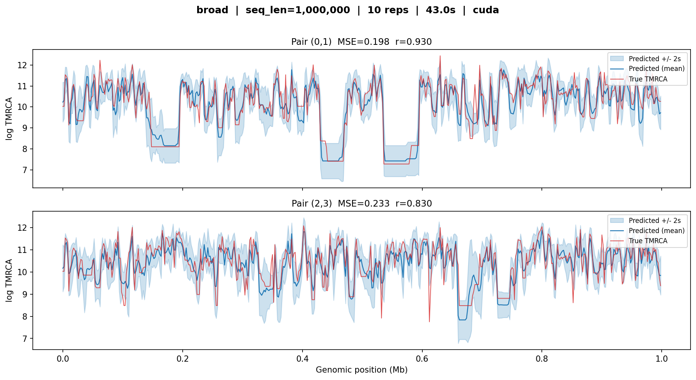
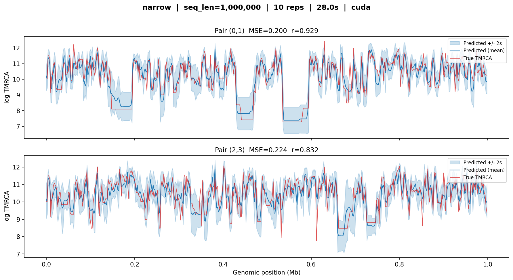
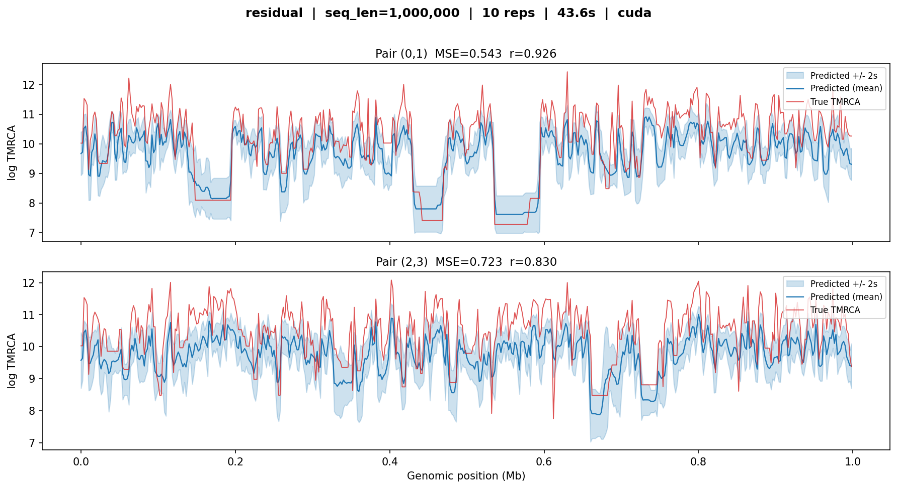
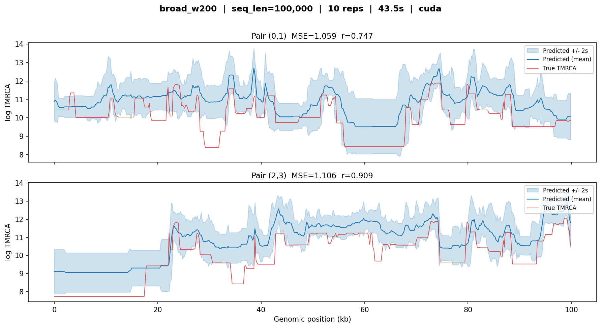
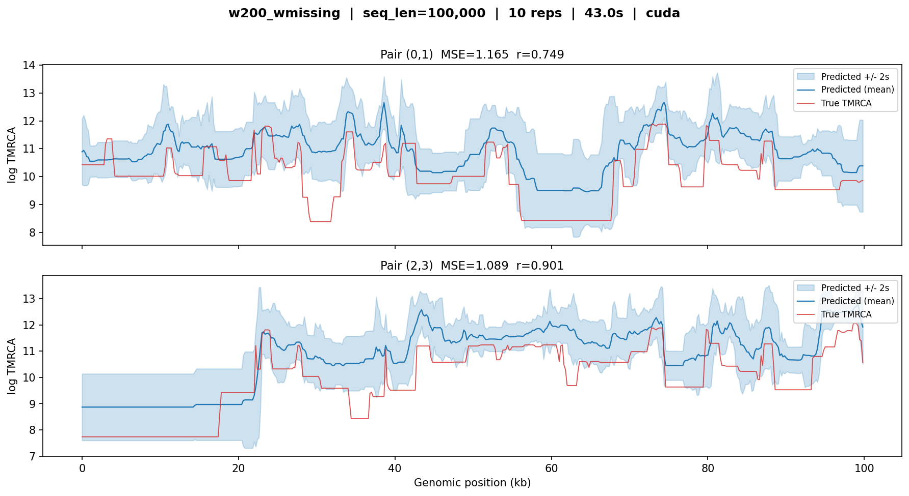
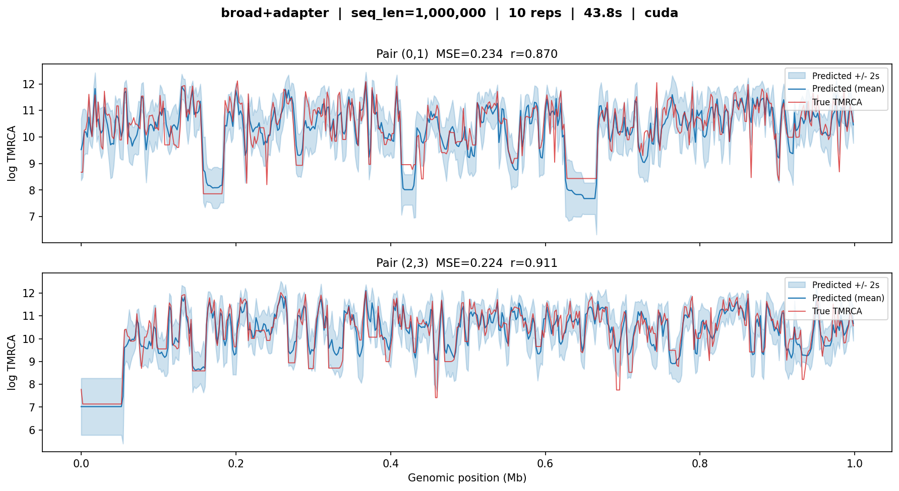
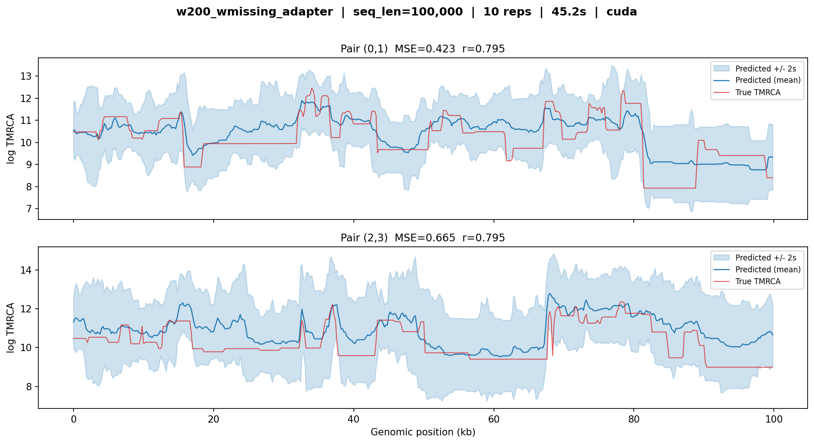
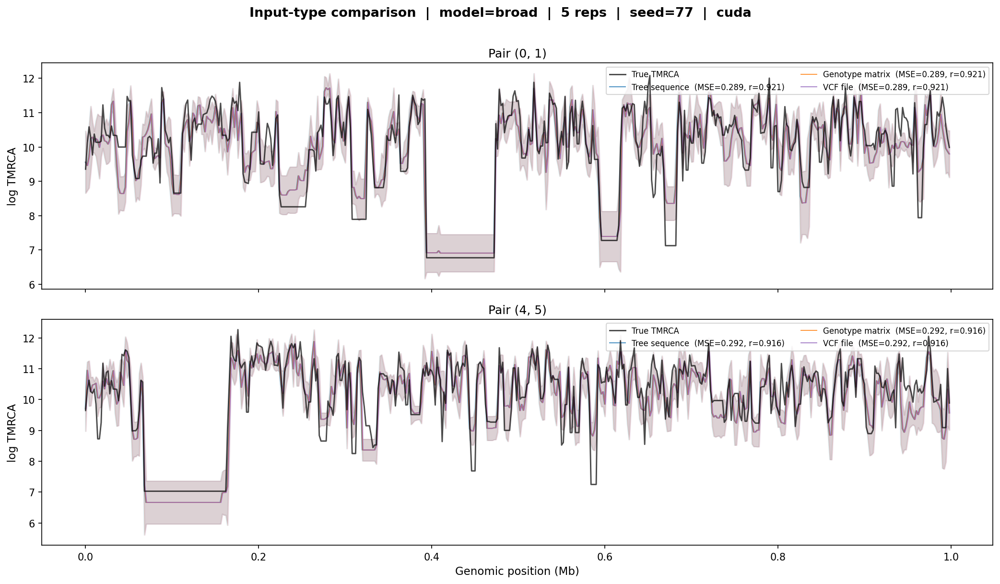
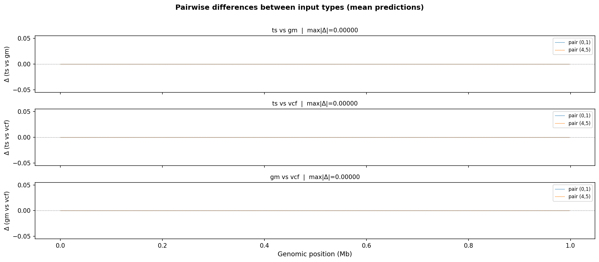

Verification
============

This page documents the verification tests that confirm every pretrained
checkpoint produces correct TMRCA predictions on simulated data. The tests
serve as both a sanity check after installation and a reference for expected
accuracy across model variants.

All verification scripts live in ``.verification/`` at the repository root.
Run them with:

.. code-block:: bash

   python .verification/verify_all_models.py    # all seven checkpoints
   python .verification/verify_input_types.py   # input-type consistency

Test protocol
-------------

Each model is verified by:

1. **Simulating** a tree sequence with ``msprime`` under constant
   :math:`N_e = 20{,}000` (seed 42).
2. **Running inference** with 10 stochastic replicates on two pivot pairs.
3. **Computing ground truth** from the tree sequence's exact genealogies.
4. **Comparing** predicted vs true log-TMRCA using MSE and Pearson
   correlation.

The w2000 models (``broad``, ``narrow``, ``residual``) are tested on 1 Mb
sequences; the w200 models (``broad_w200``, ``w200_wmissing``) on 100 kb.
Adapter models use 5 diploid individuals (10 haploid samples).

In each figure below, the blue line is the mean prediction across 10
replicates, the blue shaded band shows :math:`\pm 2\sigma`, and the red
line is the true TMRCA from the exact genealogy.

``broad``
---------

The main 10-layer model trained on all scenarios. Tested on a 1 Mb constant
:math:`N_e` simulation with 50 haploid samples.

   **broad** — MSE |approx| 0.2, r |approx| 0.83--0.93. The predicted
   curves closely track the true coalescent-time landscape across the full
   megabase, including sharp transitions at tree boundaries. Uncertainty
   bands are narrow relative to the signal.

``narrow``
----------

The smaller 6-layer model trained only on constant :math:`N_e` data.
Despite having fewer layers and a simpler training set, it achieves
comparable accuracy on this constant-:math:`N_e` test case.

   **narrow** — MSE |approx| 0.2, r |approx| 0.83--0.93. Nearly
   identical to ``broad`` on this constant-:math:`N_e` simulation, as
   expected: the narrow model was trained specifically for this regime.
   Inference is faster (28 s vs 43 s) due to fewer layers.

``residual``
------------

Predicts log-deviations from the population mean rather than absolute
log-TMRCA. Higher MSE reflects the fact that this model targets a different
objective: it sacrifices absolute-level accuracy for sharper resolution of
relative TMRCA changes between adjacent windows.

   **residual** — MSE |approx| 0.5--0.7, r |approx| 0.83--0.93. The
   model tracks the shape of the coalescent-time profile well (high
   correlation) but shows a systematic upward shift in some regions,
   consistent with the residual parameterisation requiring a separate
   baseline estimate.

``broad_w200``
--------------

The broad model fine-tuned for 200 bp windows on large-:math:`N_e` stdpopsim
species. Tested on 100 kb (500 windows of 200 bp). The shorter sequence
means fewer mutations per window and less information per prediction, so
MSE is naturally higher than the w2000 models.

   **broad_w200** — MSE |approx| 1.0--1.1, r |approx| 0.75--0.91. Higher
   MSE compared to the w2000 models reflects the reduced mutational
   information per 200 bp window. Despite this, the model captures the
   major transitions in coalescent time and maintains strong correlation.

``w200_wmissing``
-----------------

Fine-tuned from ``broad_w200`` on data with encoded missingness (see
:doc:`finetune_missingness`). This model expects a ``missingness_bitmask``
at inference time that encodes the per-window fraction of inaccessible
sites.

.. important::

   When running ``w200_wmissing`` on data with no missing sites, you must
   still pass an all-zeros bitmask:

   .. code-block:: python

      missingness_bitmask = np.zeros(seq_len, dtype=bool)

   Without this, the missingness channels in the source tensor are left
   unpopulated, and the model produces degraded predictions (MSE > 2,
   r < 0.65). With the correct bitmask, performance matches ``broad_w200``.

   **w200_wmissing** — MSE |approx| 1.1--1.2, r |approx| 0.75--0.90. With
   the missingness bitmask set to all-accessible, the model performs
   comparably to its parent ``broad_w200``.

``broad+adapter``
-----------------

The sample-size adapter on top of a frozen ``broad`` backbone. Maps
10 haploid samples to the 50-sample feature space expected by the backbone.
Tested on a 1 Mb simulation with 5 diploid individuals.

   **broad+adapter** — MSE |approx| 0.2, r |approx| 0.87--0.91. The
   adapter produces results comparable to the full ``broad`` model
   despite working with only 10 haploid samples (5 diploids). Wider
   uncertainty bands reflect the reduced information from fewer samples.

``w200_wmissing_adapter``
-------------------------

Two-stage adapter combining sample-size transfer with missingness support.
Built by resuming the ``broad+adapter`` weights on w200 + bitmask data.
Tested on 100 kb with 5 diploid individuals.

   **w200_wmissing_adapter** — MSE |approx| 0.4--0.7, r |approx| 0.80.
   Combines the challenges of small sample size (10 haplotypes), fine
   window resolution (200 bp), and missingness encoding. The higher MSE
   and wider uncertainty bands reflect these compounding difficulties.
   Correlation remains good, indicating the model captures the shape of
   the coalescent-time landscape.

Input-type consistency
----------------------

cxt accepts three input types: tree sequences, genotype matrices, and VCF
files. This test verifies that all three produce identical results by
simulating a 1 Mb tree sequence, exporting it to both a genotype matrix and
a VCF, and running inference through each path with the ``broad`` model.

   **Input-type comparison.** The tree-sequence, genotype-matrix, and
   VCF input paths produce indistinguishable TMRCA predictions (identical
   MSE and correlation for each pair). All three curves overlap completely.

   **Pairwise differences between input types.** The maximum absolute
   difference between any two input paths is zero across the entire
   genome, confirming that the three code paths are numerically equivalent.

Summary table
-------------

.. list-table::
   :header-rows: 1
   :widths: 22 12 12 10 10 12

   * - Model
     - Seq length
     - Samples
     - MSE
     - r
     - Time (s)
   * - ``broad``
     - 1 Mb
     - 50
     - 0.2
     - 0.83--0.93
     - 43
   * - ``narrow``
     - 1 Mb
     - 50
     - 0.2
     - 0.83--0.93
     - 28
   * - ``residual``
     - 1 Mb
     - 50
     - 0.5--0.7
     - 0.83--0.93
     - 44
   * - ``broad_w200``
     - 100 kb
     - 50
     - 1.0--1.1
     - 0.75--0.91
     - 44
   * - ``w200_wmissing``
     - 100 kb
     - 50
     - 1.1--1.2
     - 0.75--0.90
     - 43
   * - ``broad+adapter``
     - 1 Mb
     - 10
     - 0.2
     - 0.87--0.91
     - 44
   * - ``w200_wmissing_adapter``
     - 100 kb
     - 10
     - 0.4--0.7
     - 0.80
     - 45

Running the verification
------------------------

.. code-block:: bash

   # Verify all seven checkpoints (downloads ~700 MB on first run)
   python .verification/verify_all_models.py

   # Verify input-type consistency (tree sequence vs genotype matrix vs VCF)
   python .verification/verify_input_types.py

Checkpoints are cached in ``.verification/checkpoints/`` and reused on
subsequent runs. Set the ``CXT_CHECKPOINT_CACHE`` environment variable to
redirect the cache.

.. |approx| unicode:: U+2248
